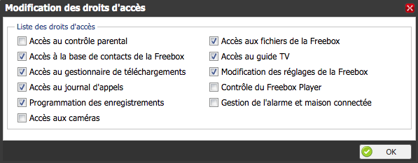

# Ansible modules for Freebox OS

## Before using Freebox OS Ansible modules

You need to configure your Freebox to accept API requests.

Launch the [initialize.yml](initialize.yml)  playbook and accept the request on your Freebox LCD Screen.

Then, go to `Paramètres de la Freebox > Divers / Gestion des Accès > Applications`

and check :white_check_mark: `Modification des réglages de la Freebox`.



## Modules

### Module 'freebox_os_switch_port'

Usage:

```yaml
# Configure Freebox Router port '2' with 'full' duplex and speed '1000'
- name: Configure port '2' with 'full' duplex and speed '1000'
  freebox_os_switch_port:
    id: 2
    duplex: 'full'
    speed: 1000
```
